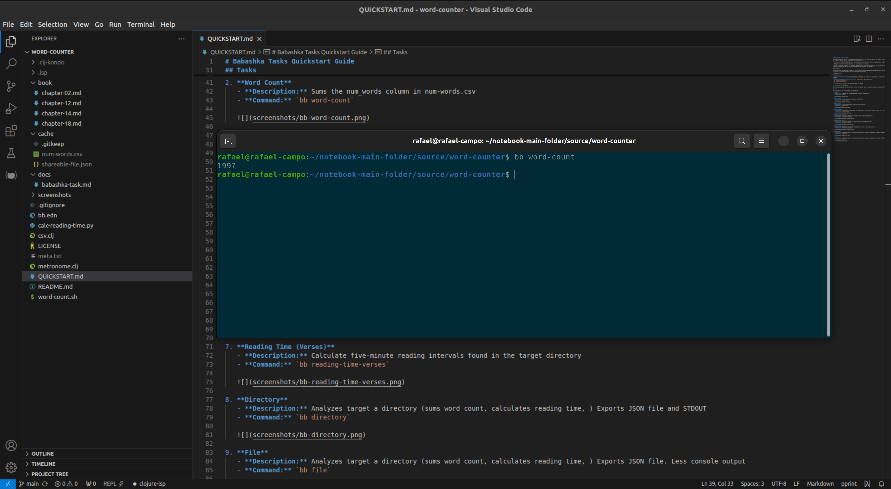
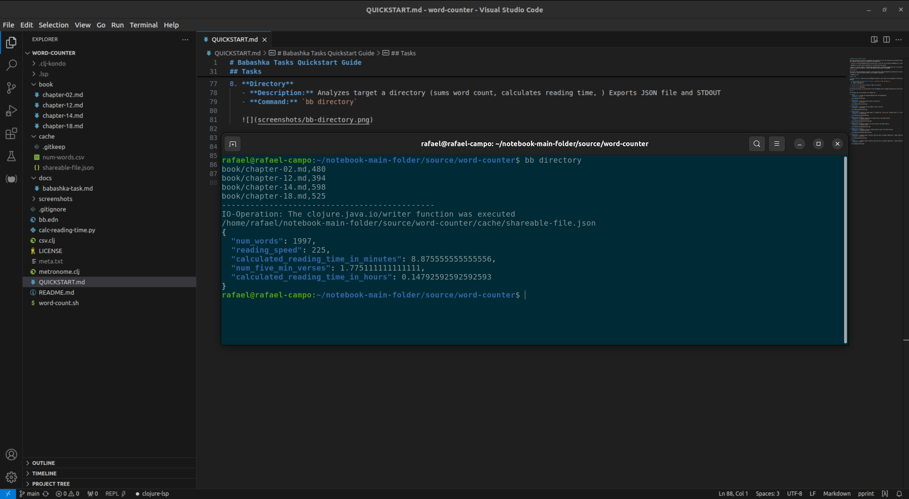

# Babashka Tasks Quickstart Guide

This guide provides an overview of the Babashka tasks available for this word counting tool and document statistical analysis using Babashka. Each task has a specific function and can be executed via the command line.

> [*Babashka Task*](docs/babashka-task.md) a discrete unit of work that can be executed independently or as part of a sequence of its kind.

> *Babashka* is a native Clojure interpreter for scripting with fast startup.

> Clojure is a concise, powerful, and performant general-purpose  programming language that runs on the Java Virtual Machine, Common Language Runtime, JavaScript runtimes (aka Node.js or modern mobile/desktop web browsers), and Babashka.

## Requirements

This project ships with batteries included. In other words after installing Babashka and granting the correct permissions to the `word-count.sh` and `metronome.clj` files you should be able to issue commands successfully.

- babashka v1.3.18

## How to Use

1. **Install Babashka**: Make sure you have Babashka installed on your system. You can download it from [Babashka GitHub](https://github.com/babashka/babashka).

2. **Grant executable file permissions to files**: `word-count.sh` and `metronome.clj`
   a. `chmod +x word-count.sh`
   b. `chmod +x metronome.clj`

3. **Execute Tasks**: The first two tasks are ready, rest need QA

4. **Customize**: In development

By following this guide, you can efficiently utilize the Babashka tasks to manage and analyze word counts and reading times in your directory.

## Tasks

The following task can be executed on the command line

1. **Help**
   - **Description:** Display the available Babashka tasks and their documentation
   - **Command:** `bb tasks`

   

2. **Word Count**
   - **Description:** Given a path, sums the num_words column in mun-words.csv
   - **Command:** `bb word-count`

   

3. **Word Total**
   - **Description:** Given a path, calculates the total number of words (recursive)
   - **Command:** `bb word-total`
   
   

4. **Reading Speed**
   - **Description:** Displays set reading speed. To configure see `reading_speed` variable found in `calc-reading-time.py`
   - **Command:** `bb reading-speed`

   

5. **Reading Time (Minute)**
   - **Description:** Calculate reading time in minutes.
   - **Command:** `bb reading-time-minute`

   

6. **Reading Time (Hour)**
   - **Description:** Calculate reading time in hours.
   - **Command:** `bb reading-time-hour`

   

7. **Reading Time (Verses)**
   - **Description:** Calculate reading time in five-minute intervals.
   - **Command:** `bb reading-time-verses`

   

8. **Directory**
   - **Description:** Given a directory sums the number of words and more
   - **Command:** `bb directory`

   

9. **File**
   - **Description:** Produces word-count, reading-count, raw to .999-refined.
   - **Command:** `bb file`

   
